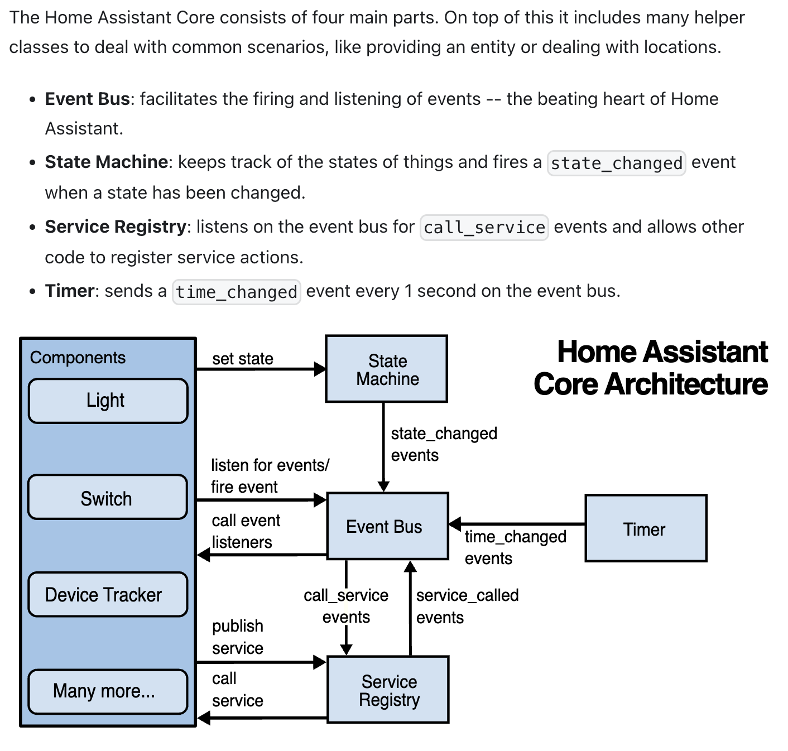

# Home Assistant

This is a clone/rebuilding of the core architecture outlined by Home Assistant. The point of this was an attempt to rebuild the architecture from the ground up thinking about how the different systems and classes would interact. My final goal for this will be to collate this with a front end app to take advantage of the API that wraps the system.

As an MVP goal I aim to have a motion sensor component that when triggered fires an event to the event bus which is then consumed by a light bulb component causing it to change state to active.

In future iterations I would like to try and integrate a raspberry pi and potentially a smart bulb into this architecture to see if it works in a full production environment

